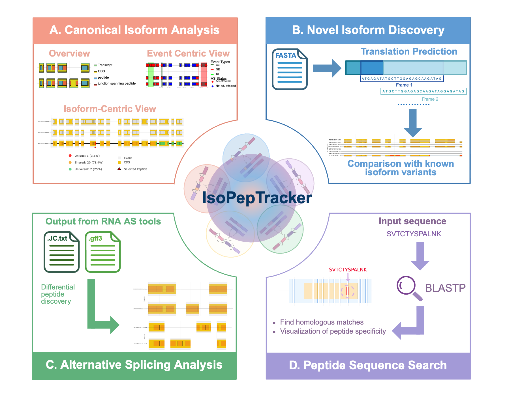

Introduction
============

A Shiny Application for Alternative Splicing Analysis and Peptide Mapping
--------------------------------------------------------------------------

IsoPepTracker is a powerful bioinformatics tool designed to visualize alternative splicing events, map peptides to genomic coordinates, and compare protein isoforms at the peptide level. It provides interactive visualizations to explore how alternative splicing influences protein diversity and peptide generation under various proteolytic digestion conditions.

**Web Portal**: https://www.isopeptracker.org

   
   IsoPepTracker web application overview

Key Features
------------

* **Interactive Peptide Visualization**: Compare peptides across isoforms
* **Comprehensive Protease Support**: Analyze peptide cleavage patterns for 6 different proteases (Trypsin, Chymotrypsin, AspN, LysC, LysN, GluC)
* **Alternative Splicing Integration**: Visualize 5 AS event types (SE, A3SS, A5SS, MXE, RI) and their impact on peptide generation
* **Novel Isoform Analysis**: Identify and characterize novel isoforms using peptides unique to the novel isoform identified through RNASeq or long read RNASeq
* **Peptide Search**: Search and visualize peptides across isoforms
* **AS Tool Support**: Process and visualize peptide consequences from rMATS and SplAdder outputs

Getting Started
---------------

To begin using IsoPepTracker:

1. Visit the `web application <https://www.isopeptracker.org>`_
2. Choose the appropriate module for your analysis
3. Follow the module-specific workflows described in this documentation

