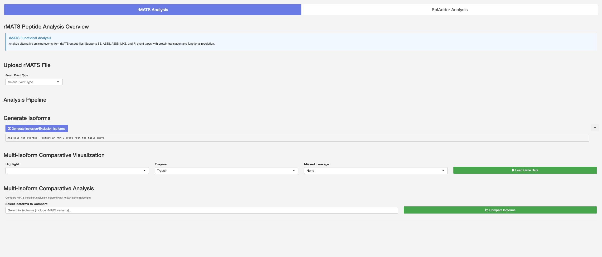
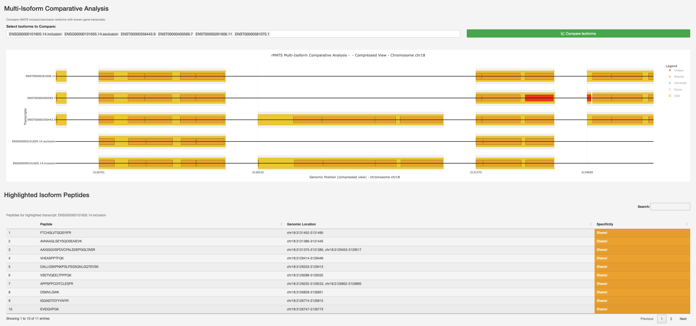

Alternative Splicing Analysis Module
====================================

Visualize and analyse alternative splicing events.

The Alternative Splicing Analysis module provides comprehensive visualization
and analysis of alternative splicing events and their impact on peptide
generation.

Supported Splicing Event Types
~~~~~~~~~~~~~~~~~~~~~~~~~~~~~~

* **SE** -- Skipped Exon
* **A3SS** -- Alternative 3' Splice Site
* **A5SS** -- Alternative 5' Splice Site
* **MXE** -- Mutually Exclusive Exons
* **RI** -- Retained Intron

Input Support
~~~~~~~~~~~~~

* **rMATS** -- Process and visualize rMATS output files
* **SplAdder** -- Compatible with SplAdder results

Key Features
~~~~~~~~~~~~

* Interactive visualization of splicing events
* Peptide consequence mapping
* Event statistics and quantification
* Comparison across conditions
* Export visualizations and data

Workflow
~~~~~~~~

1. Select the analysis mode (rMATS or SplAdder).
2. Upload output files and select the splicing event type.
3. Generate inclusion/exclusion isoforms from the selected event.
4. Configure visualization parameters (enzyme, missed cleavage).
5. Compare rMATS-derived isoforms with known gene transcripts.
6. View multi-isoform comparative visualization and peptide impacts.
7. Export results and figures.

   rMATS Peptide Analysis interface showing the analysis pipeline with
   rMATS/SplAdder tabs, file upload, event type selection, isoform
   generation, and multi-isoform comparative visualization controls.

   Multi-Isoform Comparative Analysis results showing rMATS-derived
   inclusion/exclusion isoforms compared with known gene transcripts,
   with peptide maps and a highlighted isoform peptide table showing
   specificity classifications.

Output
~~~~~~

The module generates:

* Splicing event diagrams
* Inclusion/exclusion isoform peptide maps
* Multi-isoform comparative visualizations
* Peptide specificity tables
* Exportable visualizations
