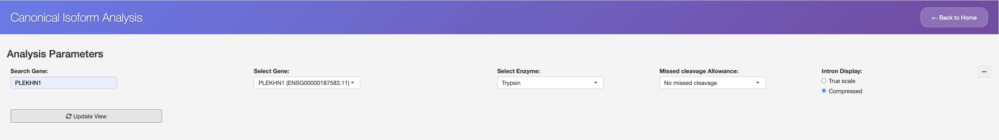
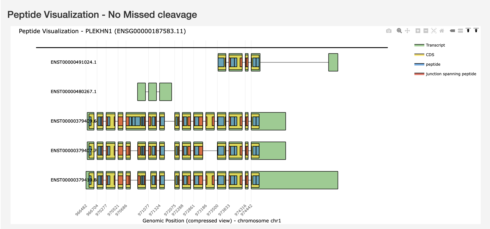
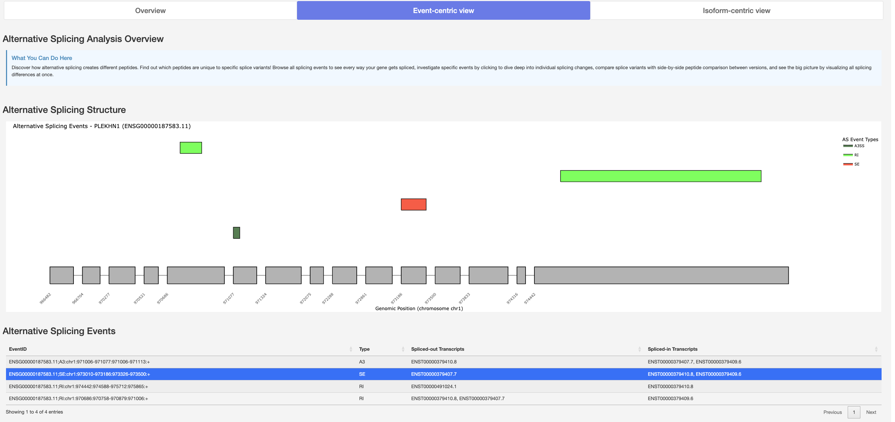
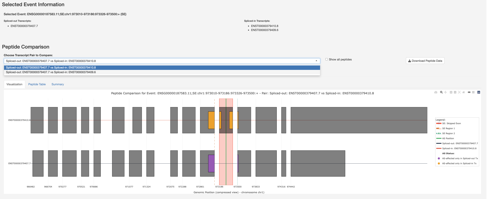
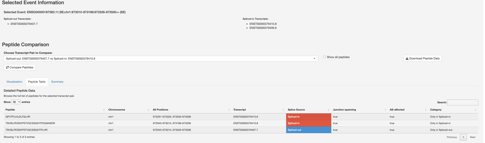
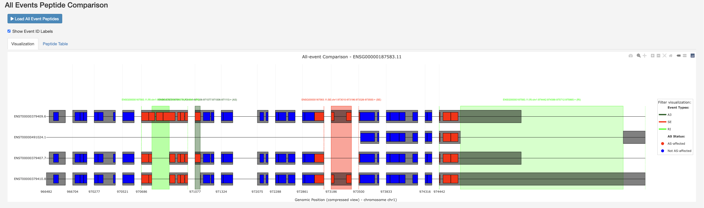
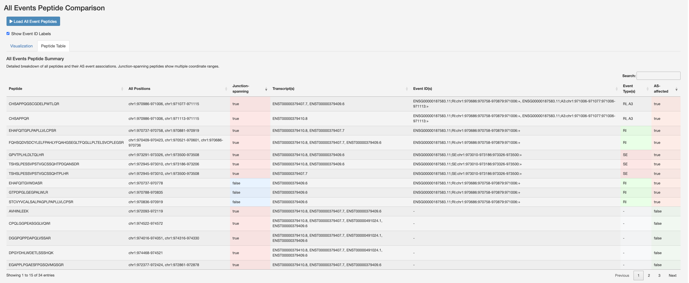
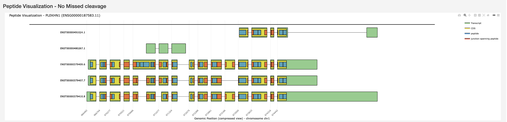

Canonical Isoform Analysis
==========================

Analyze canonical peptides across isoforms.

The Canonical module provides comprehensive analysis of known peptides across
different transcript isoforms. It is divided into three complementary analysis
approaches, accessible via the tabs at the top of the page.

   Analysis Parameters -- select a gene, enzyme, missed-cleavage allowance,
   and intron display mode before updating the view.

1. Overview Analysis
~~~~~~~~~~~~~~~~~~~~

Gene selection and basic visualization interface.

**Features:**

* Gene search and selection
* Basic gene statistics display
* Transcript information visualization
* Quick peptide summary

   The Overview tab shows the full gene structure with all transcript
   isoforms and their peptide maps at a glance.

2. Events-Centric Analysis
~~~~~~~~~~~~~~~~~~~~~~~~~~

Focus your analysis on specific splicing events and their peptide
consequences.

**Features:**

* Splicing event selection
* Event-based peptide mapping
* Visualization of event impacts on peptides
* Comparative analysis across events

   Alternative Splicing Analysis Overview showing the splicing structure
   and a table of detected splicing events with their types and affected
   transcripts.

   Peptide Comparison visualization for a selected skipped-exon (SE) event,
   highlighting the spliced region and affected peptides across transcript
   pairs.

   Detailed Peptide Data table listing each peptide with its genomic
   positions, splice source, junction-spanning status, and AS-affected
   category.

   All Events Peptide Comparison -- a genome-wide view of every splicing
   event (A3, SE, RI) overlaid on the transcript structures with
   AS-affected peptides coloured in red.

   All Events Peptide Summary table with a breakdown of peptides, their
   event associations, junction-spanning status, and event-specific
   categories.

3. Isoform-Centric Analysis
~~~~~~~~~~~~~~~~~~~~~~~~~~~~

Compare peptides across multiple transcript isoforms with detailed protease
analysis.

**Features:**

* Multi-isoform peptide comparison
* Support for 6 proteases:

  - Trypsin
  - Chymotrypsin
  - AspN
  - LysC
  - LysN
  - GluC

* Configurable miscleavage settings (0--2 miscleavages)
* Interactive peptide alignment visualization
* Isoform-specific peptide identification

   Peptide Visualization showing peptide maps across all transcript
   isoforms for the selected gene, enzyme, and cleavage settings.

Usage Workflow
~~~~~~~~~~~~~~

1. Start with **Overview** to select your gene of interest.
2. Use **Events-Centric** to analyse specific splicing events.
3. Apply **Isoform-Centric** for detailed peptide comparison across
   isoforms.
