Canonical Isoform Analysis
==========================

Analyze canonical peptides across isoforms.

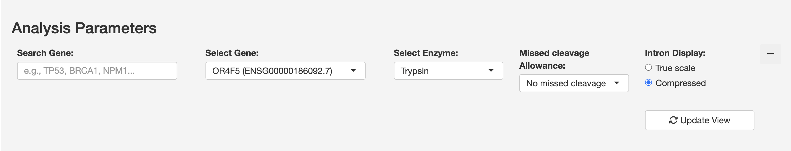

   Analysis Parameters -- select a gene, enzyme, missed-cleavage allowance,
   and intron display mode before updating the view.

The Canonical module provides comprehensive analysis of known peptides across
different transcript isoforms. It is divided into three complementary analysis
approaches, accessible via the tabs at the top of the page.

1. Overview Analysis
~~~~~~~~~~~~~~~~~~~~

Gene selection and basic visualization interface.

.. figure:: ../_static/overview.png
   :alt: Overview tab showing gene visualization
   :align: center
   :width: 100%

   The Overview tab shows the full gene structure with all transcript
   isoforms and their peptide maps at a glance.

2. Events-Centric Analysis
~~~~~~~~~~~~~~~~~~~~~~~~~~

Focus your analysis on specific splicing events and their peptide
consequences.

**Features:**

* Splicing event selection
* Visualization of event impacts on peptides

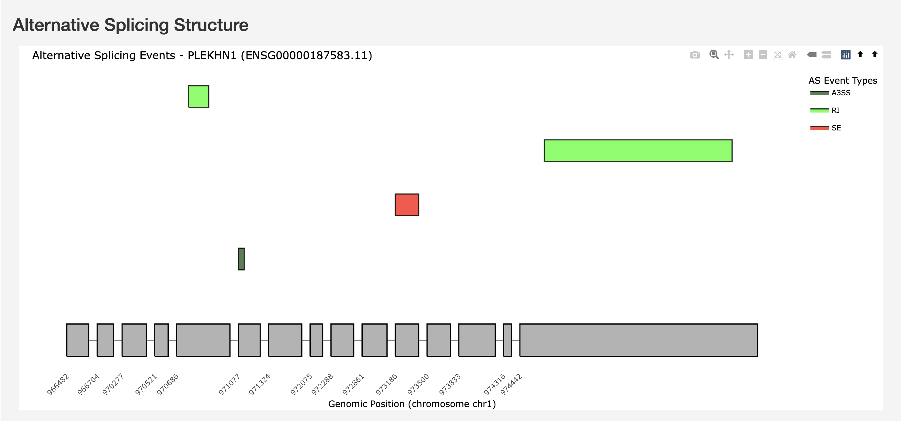

   Alternative Splicing Structure showing AS event types (A3SS, RI, SE)
   mapped on the gene structure with genomic coordinates.

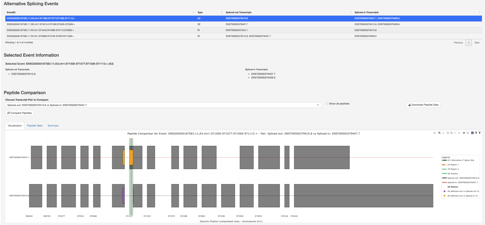

   Alternative Splicing Events table with selected event information and
   Peptide Comparison visualization for a selected splicing event,
   highlighting the spliced region and affected peptides across transcript
   pairs.

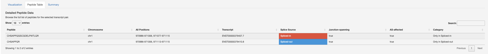

   Detailed Peptide Data table listing each peptide with its genomic
   positions, splice source, junction-spanning status, and AS-affected
   category.

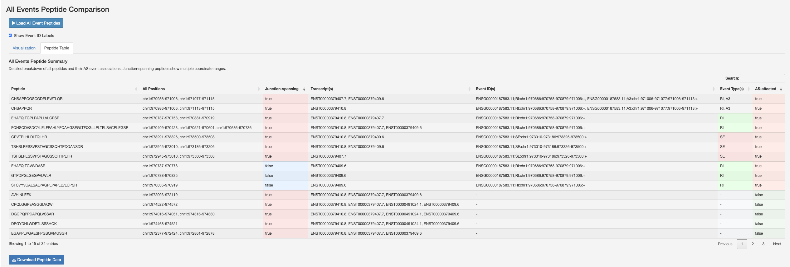

   All Events Peptide Comparison -- a gene-wide view of every splicing
   event (A3, SE, RI) overlaid on the transcript structures with
   AS-affected peptides coloured.

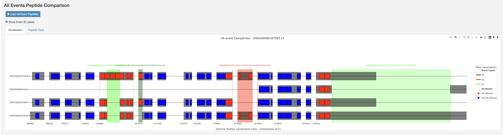

   All Events Peptide Summary table with a breakdown of peptides, their
   event associations, junction-spanning status, and event-specific
   categories.

3. Isoform-Centric Analysis
~~~~~~~~~~~~~~~~~~~~~~~~~~~~

Compare peptides across multiple transcript isoforms with detailed protease
analysis.

**Features:**

* Multi-isoform peptide comparison
* Support for 6 proteases:

  - Trypsin
  - Chymotrypsin
  - AspN
  - LysC
  - LysN
  - GluC

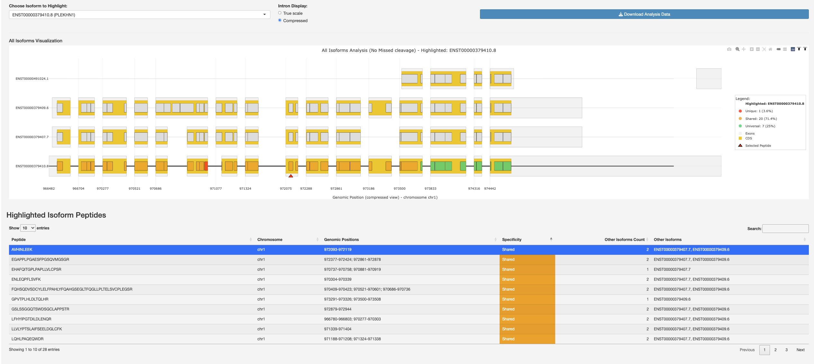

   All Isoforms Visualization with a highlighted isoform and its peptide
   table showing peptide specificity (unique, shared, universal).

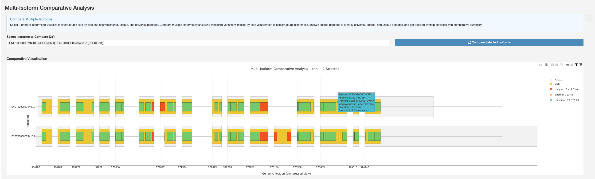

   Multi-Isoform Comparative Analysis -- select two or more isoforms to
   visualize their peptides and compare them.

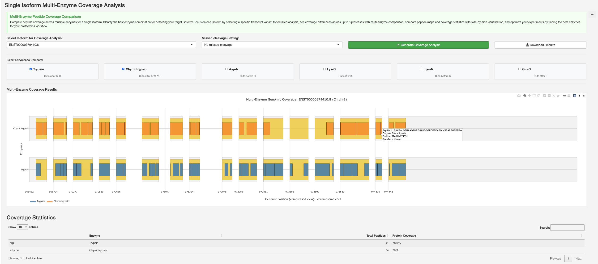

   Single Isoform Multi-Enzyme Coverage Analysis comparing peptide
   coverage across multiple enzymes for a selected isoform with coverage
   statistics.

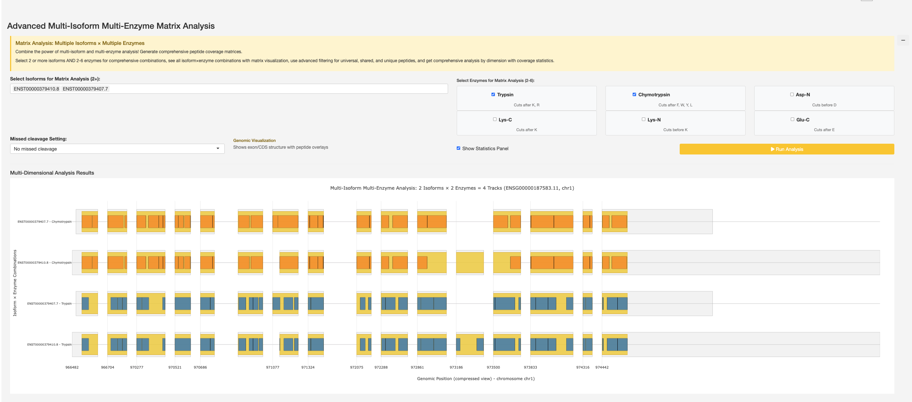

   Advanced Multi-Isoform Multi-Enzyme Matrix Analysis combining multiple
   isoforms and enzymes for comprehensive multi-dimensional peptide
   coverage analysis.

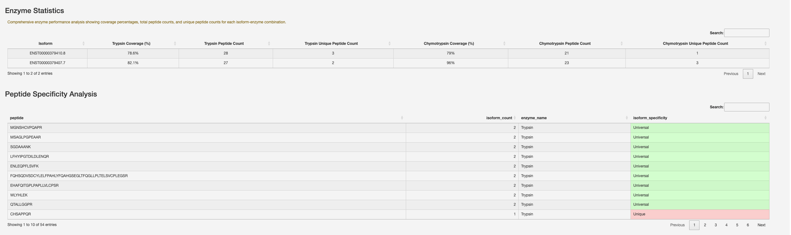

   Enzyme Statistics showing coverage percentages, peptide counts, and
   unique peptide counts per isoform-enzyme combination, alongside
   Peptide Specificity Analysis.

Usage Workflow
~~~~~~~~~~~~~~

1. Start with **Overview** to select your gene of interest.
2. Use **Events-Centric** to analyse specific splicing events.
3. Apply **Isoform-Centric** for detailed peptide comparison across
   isoforms.
