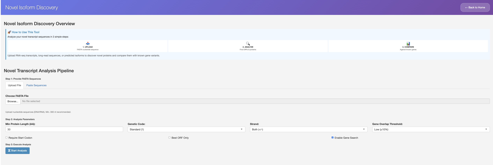
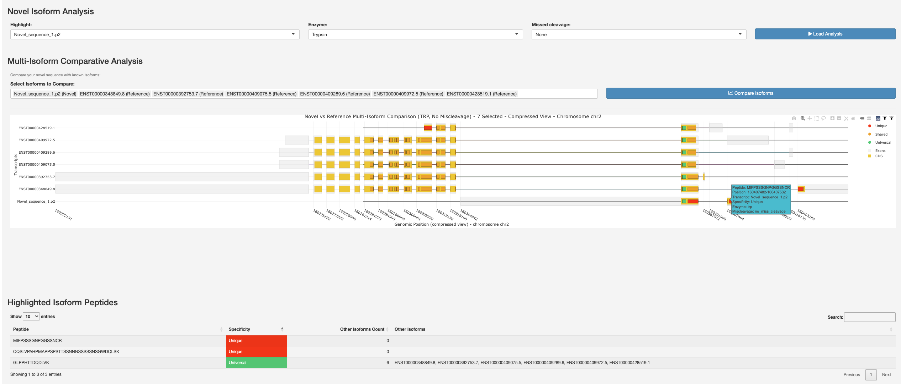

Novel Isoform Analysis
======================

Identify and characterize novel peptides from alternative splicing.

The Novel module identifies and characterizes novel peptides that arise from
alternative splicing events. These peptides may not be present in canonical
protein databases but could have important biological functions.

Key Features
~~~~~~~~~~~~

* Novel peptide identification from alternative splicing events
* BLASTP integration for functional annotation
* Comparison with known peptide sequences
* Novel peptide characterization and properties

Workflow
~~~~~~~~

1. Upload FASTA nucleotide sequences (RNA-seq transcripts, long-read
   sequences, or predicted isoforms).
2. Configure analysis parameters (minimum protein length, genetic code,
   strand, gene overlap threshold).
3. Execute ORF finding and select the best open reading frame.
4. Search candidate genes and select a reference gene for comparison.
5. Compare novel isoform peptides against known reference isoforms.
6. Review peptide specificity and export results.

   Novel Isoform Discovery Overview with a three-step pipeline
   (Upload, Analyze, Compare) and the Novel Transcript Analysis Pipeline
   for uploading FASTA sequences and configuring analysis parameters.

.. figure:: ../_static/novel-isoform-discovery_2.png
   :alt: ORF selection and gene comparison
   :align: center
   :width: 100%

   ORF selection table showing candidate open reading frames ranked by
   quality score, followed by gene comparison setup where candidate genes
   are matched for reference comparison.

   Novel Isoform Analysis showing a multi-isoform comparative
   visualization of the novel sequence against reference transcripts,
   with highlighted isoform peptides and their specificity classification
   (unique, shared).

Output
~~~~~~

The module provides:

* List of novel peptides with their sequences
* ORF quality scores and properties
* Multi-isoform comparative visualizations
* Peptide specificity analysis (unique vs shared)
* Exportable results and figures
