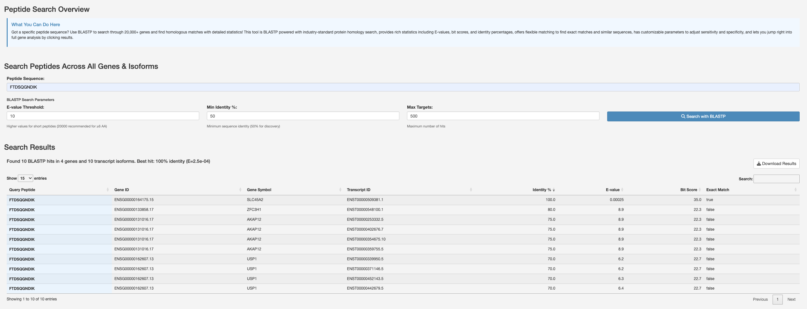
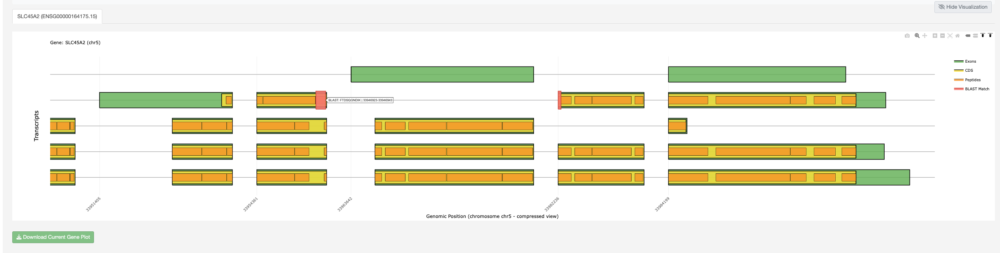

Peptide Search Module
=====================

Search for specific peptides across the database.

The Peptide Search module provides a powerful interface to search for specific
peptides across the entire IsoPepTracker database.

Search Capabilities
~~~~~~~~~~~~~~~~~~~

* Search by peptide sequence
* Search by gene name
* Search by transcript ID
* Filter by peptide properties
* BLASTP integration with configurable e-value, identity, and target thresholds

How to Use
~~~~~~~~~~

1. Enter your search query (peptide sequence, gene, or ID).
2. Set BLASTP parameters (e-value threshold, minimum identity, max targets).
3. View search results with identity percentages, e-values, and bit scores.
4. Expand results to view gene-level visualizations with BLAST match mapping.
5. Export results for further analysis.

   Peptide Search Overview showing the BLASTP search interface with
   configurable parameters and a results table listing matching genes,
   transcripts, identity scores, and bit scores.

   Gene visualization for a selected search hit, displaying transcript
   isoforms with exons, CDS regions, peptides, and the BLAST match
   position highlighted on the gene structure.

Search Results
~~~~~~~~~~~~~~

Results include:

* Matching peptide sequences
* Associated genes and transcripts
* Identity percentages and e-values
* Bit scores and best-match indicators
* Interactive gene structure visualization with BLAST match mapping
